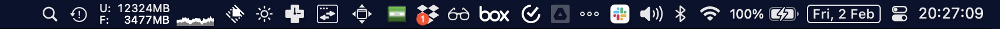
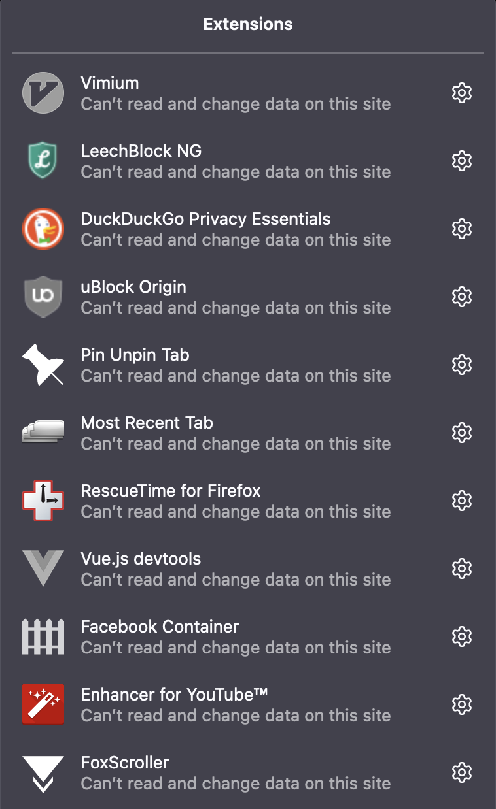

Guide to setting up a new macbook.

## Checklist before fresh install
- [x] remember FF password
- [x] check dotfiles repo for local changes
- [x] `mackup backup`
- [x] full disk time machine backup to external drive

## Menubar (for reference)



## Checklist after fresh install
- [ ] hyperswitch – no longer available as cask
- [ ] pycharm – manually cause need older version

## Setup
- Install dev tools
  ```
  xcode-select --install
  ```
- Install [brew.sh](https://brew.sh/)
  ```
  /bin/bash -c "$(curl -fsSL https://raw.githubusercontent.com/Homebrew/install/HEAD/install.sh)"
  ```
- Install brew packages
```
brew install \
	autoconf \
	cloc \
	cmake \
	coreutils \
	ddcctl \
	dokku \
	ffmpeg \
	gh \
	git \
	htop \
	hub \
	imagemagick \
	jq \
	mackup \
	m1ddc \
	node \
	pre-commit \
	pyenv \
	sqlite \
	terminal-notifier \
	tldr \
	tree \
	vim \
	watch \
	wget \
	qlmarkdown \
	qlvideo \
	quicklook-json
```
- Install brew casks
```
brew install --cask \
	adobe-acrobat-reader \
	alt-tab \
	appcleaner \
	audacity \
	bartender \
	box-drive \
	calibre \
	coconutbattery \
	devutils \
	doll \
	dropbox \
	fig \
	firefox \
	gnucash \
	google-chrome \
	google-drive \
	iterm2 \
	itsycal \
	keepingyouawake \
	lm-studio \
	menumeters \
	microsoft-remote-desktop \
	monitorcontrol \
	notion \
	obsidian \
	openinterminal-lite \
	postman \
	raycast \
	rescuetime \
	sizeup \
	slack \
	spectacle \
	spotify \
	sublime-text \
	syntax-highlight \
	ticktick \
	transmission \
	visual-studio-code \
	vlc \
	zoom
```
- install [ohmyzsh](https://ohmyz.sh/)
```
sh -c "$(curl -fsSL https://raw.github.com/ohmyzsh/ohmyzsh/master/tools/install.sh)"
```
- install zsh plugin: [`zsh-autosuggestions`](https://github.com/zsh-users/zsh-autosuggestions)
```
git clone https://github.com/zsh-users/zsh-autosuggestions ${ZSH_CUSTOM:-~/.oh-my-zsh/custom}/plugins/zsh-autosuggestions
```
- install zsh plugin: [`zsh-syntax-highlighting`](https://github.com/zsh-users/zsh-syntax-highlighting)
```
git clone https://github.com/zsh-users/zsh-syntax-highlighting.git ${ZSH_CUSTOM:-~/.oh-my-zsh/custom}/plugins/zsh-syntax-highlighting
```
- set up [dotfiles](https://github.com/nunoh/dotfiles)
  ```
  git clone https://github.com/nunoh/dotfiles ~/.dotfiles
  bash -c ~/.dotfiles/scripts/bootstrap
  ```
- install [nvm](https://github.com/nvm-sh/nvm?tab=readme-ov-file)
```
curl -o- https://raw.githubusercontent.com/nvm-sh/nvm/v0.39.7/install.sh | bash
```
- set up vim
```
git clone https://github.com/VundleVim/Vundle.vim.git ~/.vim/bundle/Vundle.vim
vim +PluginInstall
```
- restore OSX system and app preferences with [mackup](https://github.com/lra/mackup)
```
# double check what to import on `shell/.mackup.cfg`
mackup restore
```
- set up Firefox
	- login with Firefox sync
	- install extensions (don’t get synced)
	  
- set up Chrome
	- login
